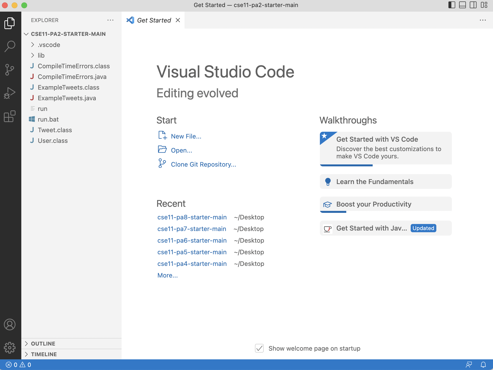
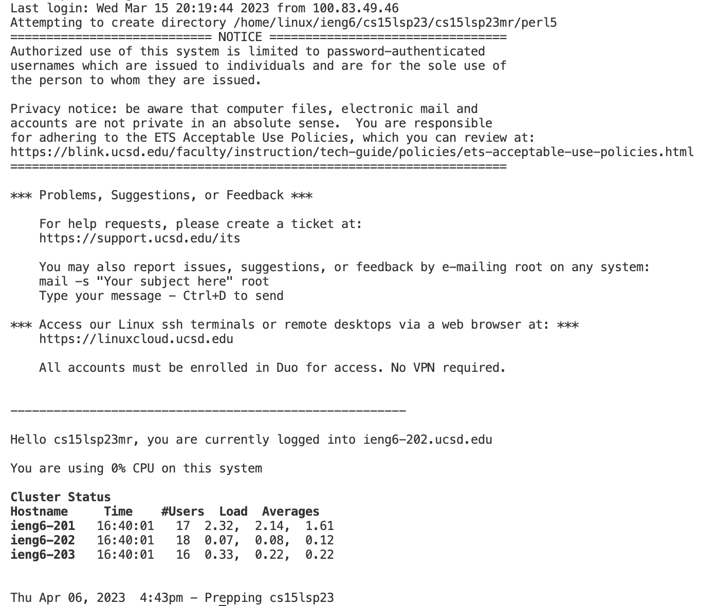
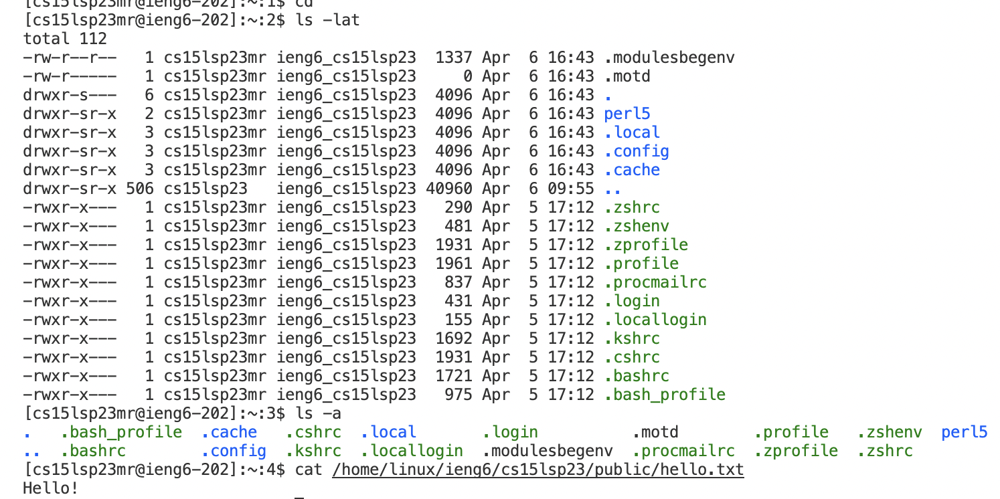

# Lab Report 1
## How to log into a course-specific account on ieng6
**1) Download Visual Studio Code**

  If you don't have vscode installed yet, you can go to vscode website and follow the instruction to download and install it. After installing vscode, you can do multiple programming tasks within it. The starting page of vscode looks like this:
  
  
**2) Remotely Connecting**

  To connect to a server remotely, you need to use your CSE 15L course-specific account. Open the terminal of vscode, and enter command "ssh username@ieng6.ucsd.edu", where “username” is the place that you replace your CSE 15L account username with it. After that, there will be a message saying "Are you sure you want to continue connecting (yes/no/[fingerprint])?". Type "yes", and enter the password of your CSE 15L account. After these procedures, you should be connected to a remote server:
  
 
**3) Trying Some Commands**

  Now you have connected to a remote server successfully, so you can try some commands in the terminal. Try to use commands such as "cd", "ls", and "cat" to access and print the files in the remote server. Different combinations of commands may produce different effects. For example, the output could look like this:

  
Overall, learning remotely connecting is a really useful and fun process.
