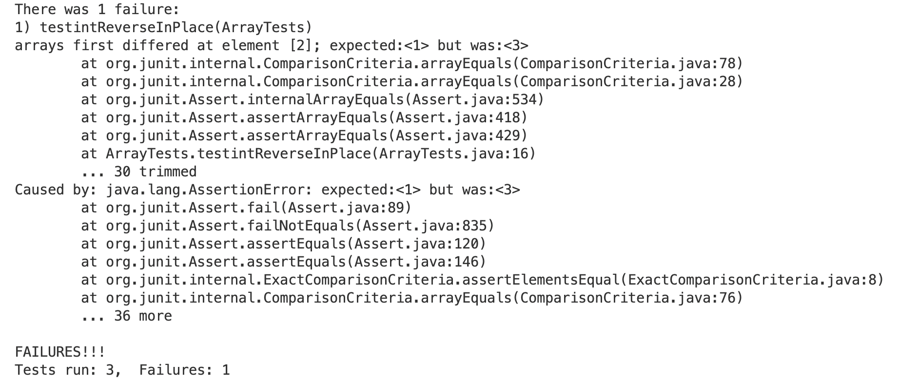

# Lab Report 2
## Part 1: String Server
**Code of my String Server:**
```
import java.io.IOException;
import java.net.URI;

class Handler implements URLHandler {
    String result = "";

    public String handleRequest(URI url) {
        if (url.getPath().equals("/")) {
            return result;
        } 
        else if (url.getPath().equals("/add-message")) {
            String[] parameters = url.getQuery().split("=");
            if (parameters[0].equals("s") == true){
                if(result.length() == 0){result = result + parameters[1];}
                else{result = result + "\n" + parameters[1];}
                return result;
            }
            else{return "404 Not Found!";}
        } 
        else if(url.getPath().equals("/search")){
            String[] parameters = url.getQuery().split("=");
            if (parameters[0].equals("s") == true){
                String searched = "";
                String[] list = result.split("\n");
                for(int i = 0; i < list.length;i++){
                    if(list[i].contains(parameters[1])){
                        if(searched.length() == 0){searched += list[i];}
                        else{searched = searched + "\n" + parameters[1];}
                    }
                }
                return searched;
            }
            else{
                return "404 Not Found!";
            }
        }
        else {
            return "404 Not Found!";
        }
    }
}

class StringServer {
    public static void main(String[] args) throws IOException {
        if(args.length == 0){
            System.out.println("Missing port number! Try any number between 1024 to 49151");
            return;
        }

        int port = Integer.parseInt(args[0]);

        Server.start(port, new Handler());
    }
}
```
**Using /add-message**

Add a string "apple":
    
- The methods called: handleRequest(), getPath(), getQuery(), split(), equals(), length(). The getPath() method obtains the path of the URL, and compares the path with "/add-message". If they are equal, the program executes the following lines. URL's query is obtained by getQuery(), then the query is seperated by split("=") to examine if the character before "=" which is assigned to "parameters[0]" is "s". The string after "=" which is assigned to "parameters[1]" in the query is the string to be added, so it is added to the result.
- a.Relevant arguments to those methods: handleRequest(): URL, take in the URL entered ; equals(): "/", "/add-message", "s", distinguish different paths and examine the input; split(): "=", split by "=" to obtain the characters before and after it;<br />
  b.Values of any relevant fields of the class: result: `result = "apple"`; parameters: `parameters = {"s", "apple"}`;
- Values of fields changed: result: changed from `result = ""` to `result = "apple"`; parameters: changed from `parameters = {}` to `parameters ={"s", "apple"}`; 

Add a string "hello":
    
- The methods called: handleRequest(), getPath(), getQuery(), split(), equals(), length()
- a.Relevant arguments to those methods: handleRequest(): URL ; equals(): "/", "/add-message", "s"; split(): "=";<br />
  b.Values of any relevant fields of the class: result: `result = "apple\nhello"`; parameters: `parameters = {"s", "hello"}`;
- Values of fields changed: result: changed from `result = "apple"` to `result = "apple\nhello"`; parameters: changed from `parameters = {}` to `parameters ={"s", "hello"}`; 
## Part 2: Bugs
Take the `reverseInPlace(int[] arr)` method in ArrayExamples.java as an example.
- Failure-inducing input: `int[] intlist2 = {1, 2, 3}`
```
  @Test
  public void testintReverseInPlace(){
    int[] intlist2 = {1, 2, 3};
    ArrayExamples.reverseInPlace(intlist2);
    assertArrayEquals(new int[]{3, 2, 1}, intlist2);
  }
```
- Input that doesn't induce a failure: `int[] input1 = { 3 }`
```
  @Test 
  public void testReverseInPlace() {
    int[] input1 = { 3 };
    ArrayExamples.reverseInPlace(input1);
    assertArrayEquals(new int[]{ 3 }, input1);
  }
```
- Symptom
    
- Bug<br />

**Before**
```
  static void reverseInPlace(int[] arr) {
    for(int i = 0; i < arr.length; i += 1) {
      arr[i] = arr[arr.length - i - 1];
    }
  }
```
**After**
```
  static void reverseInPlace(int[] arr) {
    for(int i = 0; i < arr.length/2; i += 1) { 
      int temp = arr[i]; 
      arr[i] = arr[arr.length - i - 1];
      arr[arr.length - i - 1] = temp;
    }
  }
```
The bug here is that the elements at the beginning of the array will be modified and their original data will be lost, so the elements at the end of the array are not correctly reversed. By testing with an array with 3 different integers, the failure occurs, saying the the element at index 2 is not reversed. Then I simulate the process, writing out the value at the indexes after each iteration and found out that the element at index 0 is already changed to the value at index 2, so when java is assigning value at index 2 to be the value at index 0, the arr[2] is not changed. Thus, I made the method flips the elements simultaneously and makes sure that the original element is not lost due to the element change.
## Part 3
I learned how to use the server to build a search engine, and run the server on a remote computer in week 2 lab.<br />
I learned how to debug through the symptoms and JUnit tests in week 3 lab.
