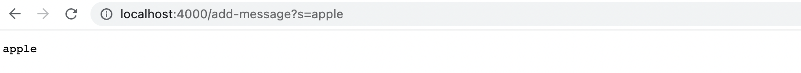

# Lab Report 2
## Part 1: String Server
**Code of my String Server:**
```
import java.io.IOException;
import java.net.URI;

class Handler implements URLHandler {
    String result = "";

    public String handleRequest(URI url) {
        if (url.getPath().equals("/")) {
            return result;
        } 
        else if (url.getPath().equals("/add-message")) {
            String[] parameters = url.getQuery().split("=");
            if (parameters[0].equals("s") == true){
                if(result.length() == 0){result = result + parameters[1];}
                else{result = result + "\n" + parameters[1];}
                return result;
            }
            else{return "404 Not Found!";}
        } 
        else if(url.getPath().equals("/search")){
            String[] parameters = url.getQuery().split("=");
            if (parameters[0].equals("s") == true){
                String searched = "";
                String[] list = result.split("\n");
                for(int i = 0; i < list.length;i++){
                    if(list[i].contains(parameters[1])){
                        if(searched.length() == 0){searched += list[i];}
                        else{searched = searched + "\n" + parameters[1];}
                    }
                }
                return searched;
            }
            else{
                return "404 Not Found!";
            }
        }
        else {
            return "404 Not Found!";
        }
    }
}

class StringServer {
    public static void main(String[] args) throws IOException {
        if(args.length == 0){
            System.out.println("Missing port number! Try any number between 1024 to 49151");
            return;
        }

        int port = Integer.parseInt(args[0]);

        Server.start(port, new Handler());
    }
}
```
**Using /add-message**

Add a string "apple":
    
- The methods called: handleRequest(), getPath(), getQuery(), split(), equals(), length()
- a.Relevant arguments to those methods: handleRequest(): URL ; equals(): "/", "/add-message", "s"; split(): "=";<br />
  b.Values of any relevant fields of the class: result: `result = "apple"`; parameters: `parameters = {"s", "apple"}`;
- Values of fields changed: result: changed from `result = ""` to `result = "apple"`; parameters: changed from `parameters = {}` to `parameters ={"s", "apple"}`; 

Add a string "hello":
    
- The methods called: handleRequest(), getPath(), getQuery(), split(), equals(), length()
- a.Relevant arguments to those methods: handleRequest(): URL ; equals(): "/", "/add-message", "s"; split(): "=";<br />
  b.Values of any relevant fields of the class: result: `result = "apple\nhello"`; parameters: `parameters = {"s", "hello"}`;
- Values of fields changed: result: changed from `result = "apple"` to `result = "apple\nhello"`; parameters: changed from `parameters = {}` to `parameters ={"s", "hello"}`; 
## Part 2: Bugs
Take the `reverseInPlace(int[] arr)` method in ArrayExamples.java as an example.
- Failure-inducing input: `int[] intlist2 = {1, 2, 3}`
```
  @Test
  public void testintReverseInPlace(){
    int[] intlist2 = {1, 2, 3};
    ArrayExamples.reverseInPlace(intlist2);
    assertArrayEquals(new int[]{3, 2, 1}, intlist2);
  }
```
- Input that doesn't induce a failure: `int[] input1 = { 3 }`
```
  @Test 
  public void testReverseInPlace() {
    int[] input1 = { 3 };
    ArrayExamples.reverseInPlace(input1);
    assertArrayEquals(new int[]{ 3 }, input1);
  }
```
- Symptom
    
- Bug<br />

**Before**
```
  static void reverseInPlace(int[] arr) {
    for(int i = 0; i < arr.length; i += 1) {
      arr[i] = arr[arr.length - i - 1];
    }
  }
```
**After**
```
  static void reverseInPlace(int[] arr) {
    for(int i = 0; i < arr.length/2; i += 1) { 
      int temp = arr[i]; 
      arr[i] = arr[arr.length - i - 1];
      arr[arr.length - i - 1] = temp;
    }
  }
```
The fix flips the elements simultaneously and makes sure that the original element is not lost due to the element change.
## Part 3
I learned how to use the server to build a search engine, and run the server on a remote computer in week 2 lab.<br />
I learned how to debug through the symptoms and JUnit tests in week 3 lab.
