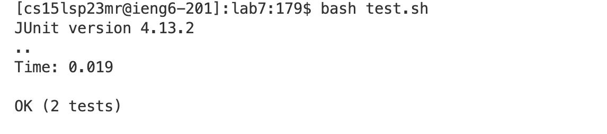
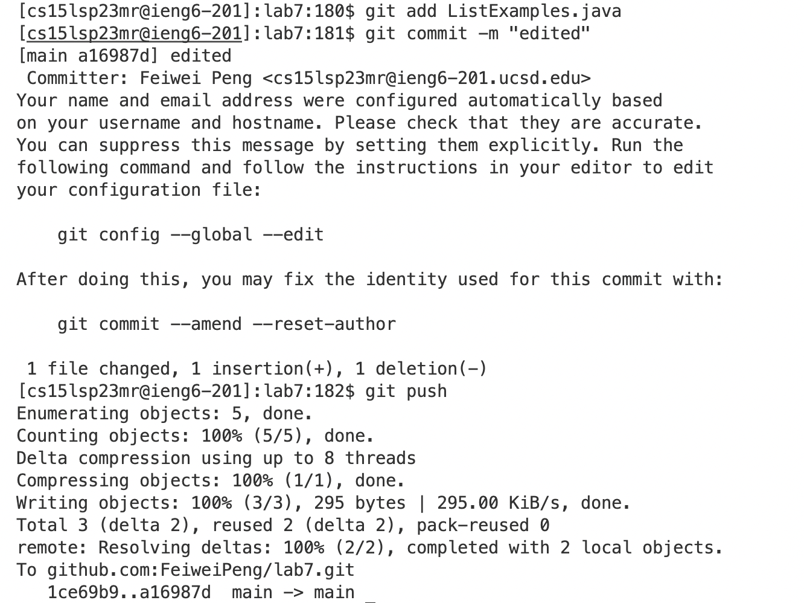

# Lab Report 4
## Editing From The Command Line
In this Lab Report, I'm going to edit the code from command line and record the keys I pressed in each step. 
**Step 4: Log into ieng6**  
Keys pressed: `Ctrl-R ssh<enter>`
 
First, I pressed Ctrl-R to search the command history, and typed "ssh" so I can search the ssh commands with my username I used in the past. Then press enter to confirm the command, and I successfully logged into ieng6.  
**Step 5: Clone**  
Keys pressed: `git<space>clone<space>Ctrl-V<enter>`

I typed "git clone" and copied and pasted my SSH key(git@github.com:FeiweiPeng/lab7.git) of the lab7 repository from my github to the terminal. Then pressed enter to continue and this repository is cloned to ieng6.  
**Step 6: Run the tests** 
Keys pressed: `cd<space>lab7<enter>` `bash<space>test.sh<enter>`

First I typed "cd lab7" to move to lab7 directory, so I can run the tests. Then I typed "bash test.sh" to run the tests using the script that is already written with out typing the long commands. A failure occurred after running the test. 
**Step 7: Edit the code** 
Keys pressed: `vim<space>Shift-l ist<tab>.java<enter>` `/chan<enter>jllxi2<esc>:wq<enter>`

Type "vim" to edit the file in command line, then type "List" and tab to autofill the remaining characters, and type ".java" to finish the file name. In the vim, type "/" to enter the search mode, and search "chan" and enter to move cursor to word "change" in the comment line. Then type "jll" to move cursor to "1" after "index". Type "x" to delete the "1", type "i" to enter insert mode, then type "2" to correct the mistake. After that, use esc to back to normal mode, and type ":wq" to save and exit vim. Thus, the error in the code is fixed. 
**Step 8: Run the tests** 
Keys pressed: `bash<space>test.sh<enter>`

Back to the command line, type "bash test.sh" again to run the tests. There shouldn't be any failures as we just fixed the mistake. 
**Step 9: Commit and push** 
Keys pressed: `git<space>add<space>Shift-l ist<tab>.java<enter>` `git<space>commit<space>-m<space>Shift-" edited Shift-"<enter>` `git<space>push<enter>`

Type "git add" plus the name of the file we just edited, and type "git commit" with option "-m" to add the message "edited", then type "git push" to push the change to my repository.  
**Summary** 
1. Ctrl-R: search the history of commands used before.
2. git clone: clone the repository.
3. Ctrl-V: paste the text just copied.
4. cd: change the current directory to the directory entered after this command.
5. bash: run the shell scripts.
6. vim: open vim.
7. tab: autofill the rest of the line until there are multiple possibilities.
8. /: enter search mode in vim.
9. j: move cursor one line down.
10. l: move cursor one character to the right.
11. x: delete the character pointed by the cursor.
12. i: enter insert mode in vim.
13. escape: back to normal mode in vim.
14. :w : save the changes in vim.
15. :q : exit vim.
16. git add: add changes or new files to the staging area.
17. git commit -m: commit the changes and add a message.
18. git push: push the changes to repository

