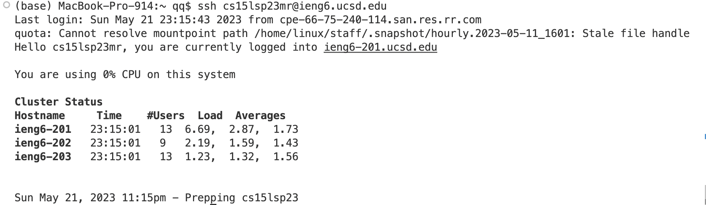

# Lab Report 4
## Editing From The Command Line
In this Lab Report, I'm going to edit the code from command line and record the keys I pressed in each step. 
**Step 4: Log into ieng6**  
Keys pressed: `Ctrl-R ssh <enter>`
 
First, I pressed Ctrl-R to search the command history, and typed "ssh" so I can search the ssh commands with my username I used in the past. Then press enter to confirm the command, and I successfully logged into ieng6.  
**Step 5:Clone**  
Keys pressed: `git<space>clone<space>Ctrl-V<enter>`

