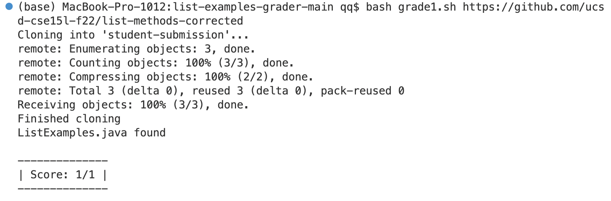
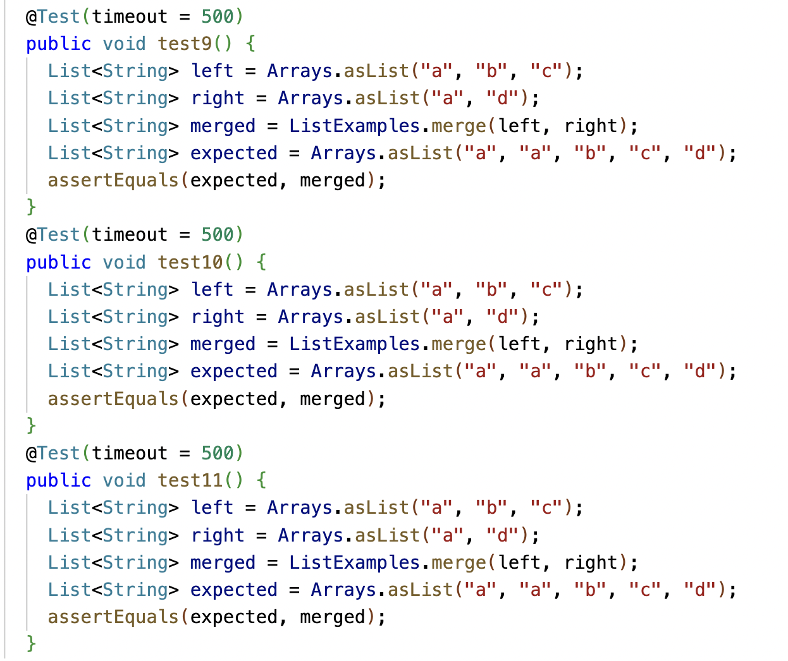
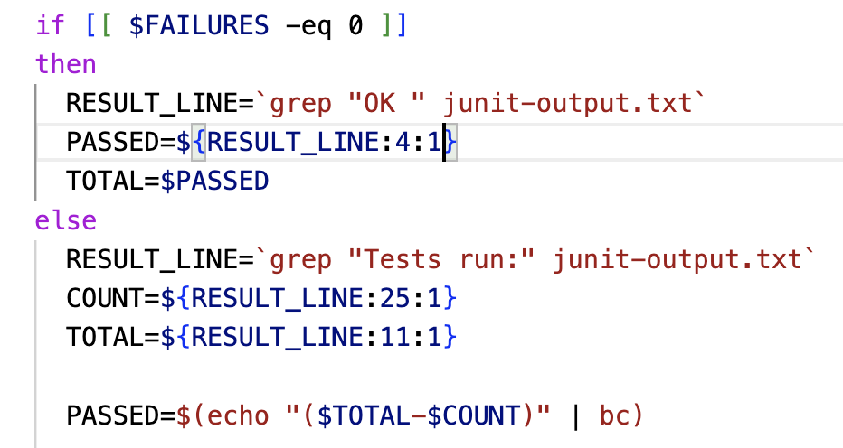
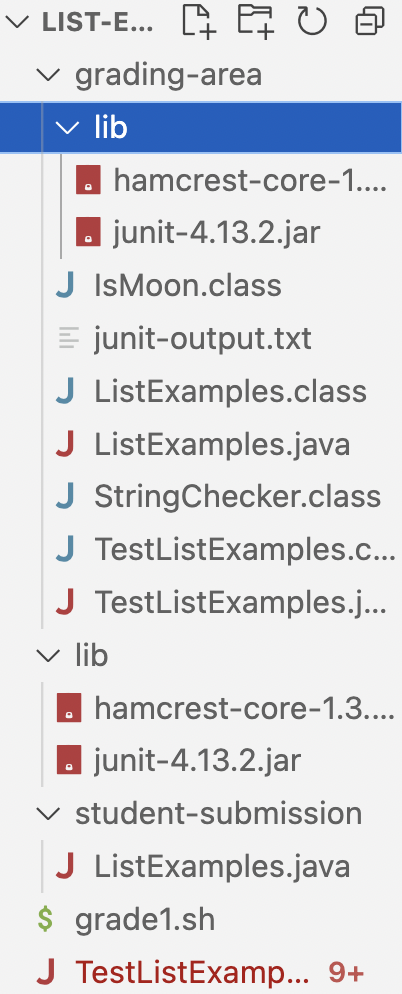
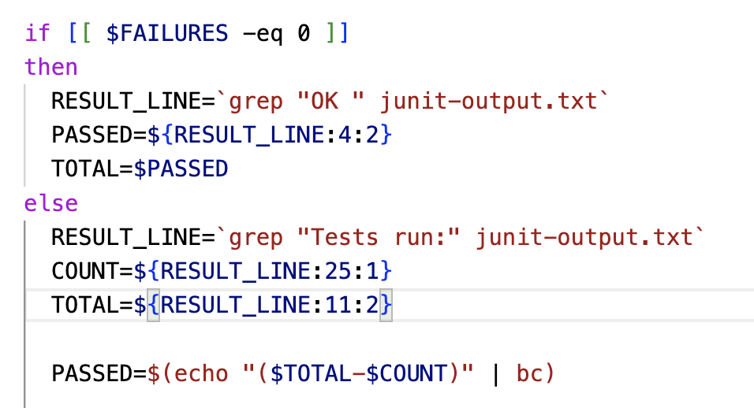

# Lab Report 5
## Part 1: Debugging Scenario
**Original Post:** <br />
**What environment are you using (computer, operating system, web browser, terminal/editor, and so on)?** <br />
I'm using a MacBook and writing the code using VScode.<br />
**Detail the symptom you're seeing. Be specific; include both what you're seeing and what you expected to see instead. Screenshots are great, copy-pasted terminal output is also great. Avoid saying “it doesn't work”.** <br />
I'm done with writing the grader script, but the score part always shows 1/1 even though I have many tests in the TestListExamples.java. I tried to add and delete the test, but it still shows "score: 1/1". The score should change along with the number of tests in the TestListExamples.java. I feel like the problem is the redirection of the output or the counting of the tests.


**Detail the failure-inducing input and context. That might mean any or all of the command you're running, a test case, command-line arguments, working directory, even the last few commands you ran. Do your best to provide as much context as you can.**<br />
The command I used is: "bash grade1.sh [Link](https://github.com/ucsd-cse15l-f22/list-methods-corrected)", the url is the repository containing my ListExamples.java. The script grade1.sh is the grader script provided by professor.<br />
**Response From TA:**
In this grader script, we use "grep" to extract the failure information and use the slicing of string to find the number of tests run and number of failures. In the original script, the slicing length is one, which is appropriate when you have single-digit number of tests. Thus, if you use more digit number of tests, the slicing length should change, too.

**Finding the Bug**<br />
I checked the failure counting part of the script, and realized that the script first finds the result line of JUnit, and then extract the number of tests and failures from that line. The slicing length was 1, but the result line of my tests was:<br />

So script only extracts the "1" of "12", showing the score as 1/1. The original script looks like:<br />

To fix the bug, I need to change the length of slicing so if can get the number of tests and failures correctly.<br />
**Information about the setup**<br />
**The file & directory structure:**<br />

**The content of grade1.sh before fixing:** <br />
```
CPATH='.:lib/hamcrest-core-1.3.jar:lib/junit-4.13.2.jar'

rm -rf student-submission
rm -rf grading-area

mkdir grading-area

git clone $1 student-submission
echo 'Finished cloning'

if [[ -f student-submission/ListExamples.java ]]
then
  echo 'ListExamples.java found'
else
  echo 'ListExamples.java not found'
  echo 'Score: 0/4'
  exit 1
fi

cp student-submission/ListExamples.java ./grading-area

cp TestListExamples.java grading-area/
cp -r lib grading-area/

cd grading-area

javac -cp $CPATH *.java

java -cp $CPATH org.junit.runner.JUnitCore TestListExamples > junit-output.txt

FAILURES=`grep -c FAILURES!!! junit-output.txt`


if [[ $FAILURES -eq 0 ]]
then
  RESULT_LINE=`grep "OK " junit-output.txt`
  PASSED=${RESULT_LINE:4:1}
  TOTAL=$PASSED
else
  RESULT_LINE=`grep "Tests run:" junit-output.txt`
  COUNT=${RESULT_LINE:25:1}
  TOTAL=${RESULT_LINE:11:1}

  PASSED=$(echo "($TOTAL-$COUNT)" | bc)

  echo "JUnit output was:"
  cat junit-output.txt
fi

echo ""
echo "--------------"
echo "| Score: $PASSED/$TOTAL |"
echo "--------------"
echo ""
```
**The content of TestListExamples.java before fixing:**<br />
```
import static org.junit.Assert.*;
import org.junit.*;
import java.util.Arrays;
import java.util.List;

class IsMoon implements StringChecker {
  public boolean checkString(String s) {
    return s.equalsIgnoreCase("moon");
  }
}

public class TestListExamples {
  @Test(timeout = 500)
  public void testMergeRightEnd() {
    List<String> left = Arrays.asList("a", "b", "c");
    List<String> right = Arrays.asList("a", "d");
    List<String> merged = ListExamples.merge(left, right);
    List<String> expected = Arrays.asList("a", "a", "b", "c", "d");
    assertEquals(expected, merged);
  }
  @Test(timeout = 500)
  public void test1() {
    List<String> left = Arrays.asList("a", "b", "c");
    List<String> right = Arrays.asList("a", "d");
    List<String> merged = ListExamples.merge(left, right);
    List<String> expected = Arrays.asList("a", "a", "b", "c", "d");
    assertEquals(expected, merged);
  }
  @Test(timeout = 500)
  public void test2() {
    List<String> left = Arrays.asList("a", "b", "c");
    List<String> right = Arrays.asList("a", "d");
    List<String> merged = ListExamples.merge(left, right);
    List<String> expected = Arrays.asList("a", "a", "b", "c", "d");
    assertEquals(expected, merged);
  }
  @Test(timeout = 500)
  public void test3() {
    List<String> left = Arrays.asList("a", "b", "c");
    List<String> right = Arrays.asList("a", "d");
    List<String> merged = ListExamples.merge(left, right);
    List<String> expected = Arrays.asList("a", "a", "b", "c", "d");
    assertEquals(expected, merged);
  }
  @Test(timeout = 500)
  public void test4() {
    List<String> left = Arrays.asList("a", "b", "c");
    List<String> right = Arrays.asList("a", "d");
    List<String> merged = ListExamples.merge(left, right);
    List<String> expected = Arrays.asList("a", "a", "b", "c", "d");
    assertEquals(expected, merged);
  }
  @Test(timeout = 500)
  public void test5() {
    List<String> left = Arrays.asList("a", "b", "c");
    List<String> right = Arrays.asList("a", "d");
    List<String> merged = ListExamples.merge(left, right);
    List<String> expected = Arrays.asList("a", "a", "b", "c", "d");
    assertEquals(expected, merged);
  }
  @Test(timeout = 500)
  public void test6() {
    List<String> left = Arrays.asList("a", "b", "c");
    List<String> right = Arrays.asList("a", "d");
    List<String> merged = ListExamples.merge(left, right);
    List<String> expected = Arrays.asList("a", "a", "b", "c", "d");
    assertEquals(expected, merged);
  }
  @Test(timeout = 500)
  public void test7() {
    List<String> left = Arrays.asList("a", "b", "c");
    List<String> right = Arrays.asList("a", "d");
    List<String> merged = ListExamples.merge(left, right);
    List<String> expected = Arrays.asList("a", "a", "b", "c", "d");
    assertEquals(expected, merged);
  }
  @Test(timeout = 500)
  public void test8() {
    List<String> left = Arrays.asList("a", "b", "c");
    List<String> right = Arrays.asList("a", "d");
    List<String> merged = ListExamples.merge(left, right);
    List<String> expected = Arrays.asList("a", "a", "b", "c", "d");
    assertEquals(expected, merged);
  }
  @Test(timeout = 500)
  public void test9() {
    List<String> left = Arrays.asList("a", "b", "c");
    List<String> right = Arrays.asList("a", "d");
    List<String> merged = ListExamples.merge(left, right);
    List<String> expected = Arrays.asList("a", "a", "b", "c", "d");
    assertEquals(expected, merged);
  }
  @Test(timeout = 500)
  public void test10() {
    List<String> left = Arrays.asList("a", "b", "c");
    List<String> right = Arrays.asList("a", "d");
    List<String> merged = ListExamples.merge(left, right);
    List<String> expected = Arrays.asList("a", "a", "b", "c", "d");
    assertEquals(expected, merged);
  }
  @Test(timeout = 500)
  public void test11() {
    List<String> left = Arrays.asList("a", "b", "c");
    List<String> right = Arrays.asList("a", "d");
    List<String> merged = ListExamples.merge(left, right);
    List<String> expected = Arrays.asList("a", "a", "b", "c", "d");
    assertEquals(expected, merged);
  }
}
```
**The content of ListExamples.java before fixing:** <br />
```
import java.util.ArrayList;
import java.util.List;

interface StringChecker { boolean checkString(String s); }

class ListExamples {

  // Returns a new list that has all the elements of the input list for which
  // the StringChecker returns true, and not the elements that return false, in
  // the same order they appeared in the input list;
  static List<String> filter(List<String> list, StringChecker sc) {
    List<String> result = new ArrayList<>();
    for(String s: list) {
      if(sc.checkString(s)) {
        result.add(s);
      }
    }
    return result;
  }


  // Takes two sorted list of strings (so "a" appears before "b" and so on),
  // and return a new list that has all the strings in both list in sorted order.
  static List<String> merge(List<String> list1, List<String> list2) {
    List<String> result = new ArrayList<>();
    int index1 = 0, index2 = 0;
    while(index1 < list1.size() && index2 < list2.size()) {
      if(list1.get(index1).compareTo(list2.get(index2)) < 0) {
        result.add(list1.get(index1));
        index1 += 1;
      }
      else {
        result.add(list2.get(index2));
        index2 += 1;
      }
    }
    while(index1 < list1.size()) {
      result.add(list1.get(index1));
      index1 += 1;
    }
    while(index2 < list2.size()) {
      result.add(list2.get(index2));
      index2 += 1;
    }
    return result;
  }
}
```
**The command line to trigger bug:**<br />
`bash grade1.sh https://github.com/ucsd-cse15l-f22/list-methods-corrected`
**What to edit to fix the bug** <br />
Change the code `PASSED=${RESULT_LINE:4:1}` to `PASSED=${RESULT_LINE:4:2}` and `TOTAL=${RESULT_LINE:11:1}` to `TOTAL=${RESULT_LINE:11:2}`. So the code after fixing should look like:

## Part 2: Reflection<br />
I learned a lot about the script language and how to write a script. I didn't know what a script is before, so I was excited the first time I learned it. Although I think it's fun to write a script and use it to do many things, it can be very complicated when it comes to grading script, and I struggled a lot when I was writing it. Now I know how gradescope works and its working principles behind, which is super cool to me.
